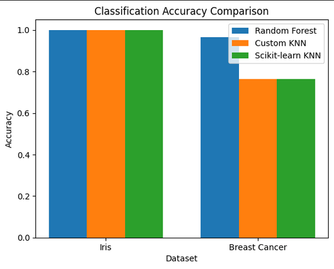
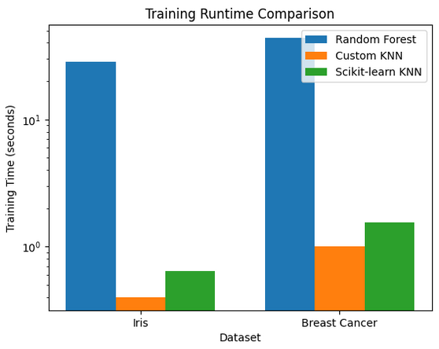
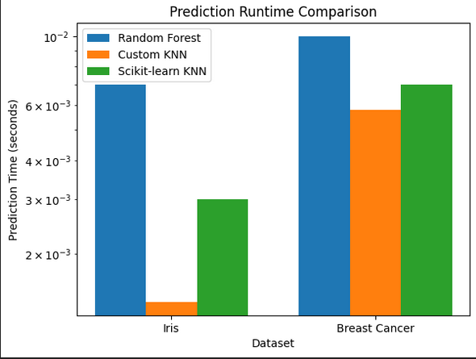
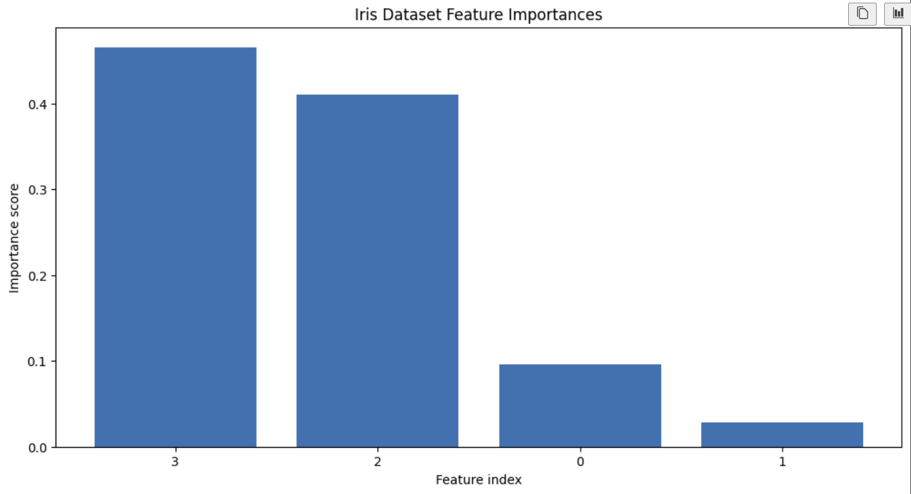
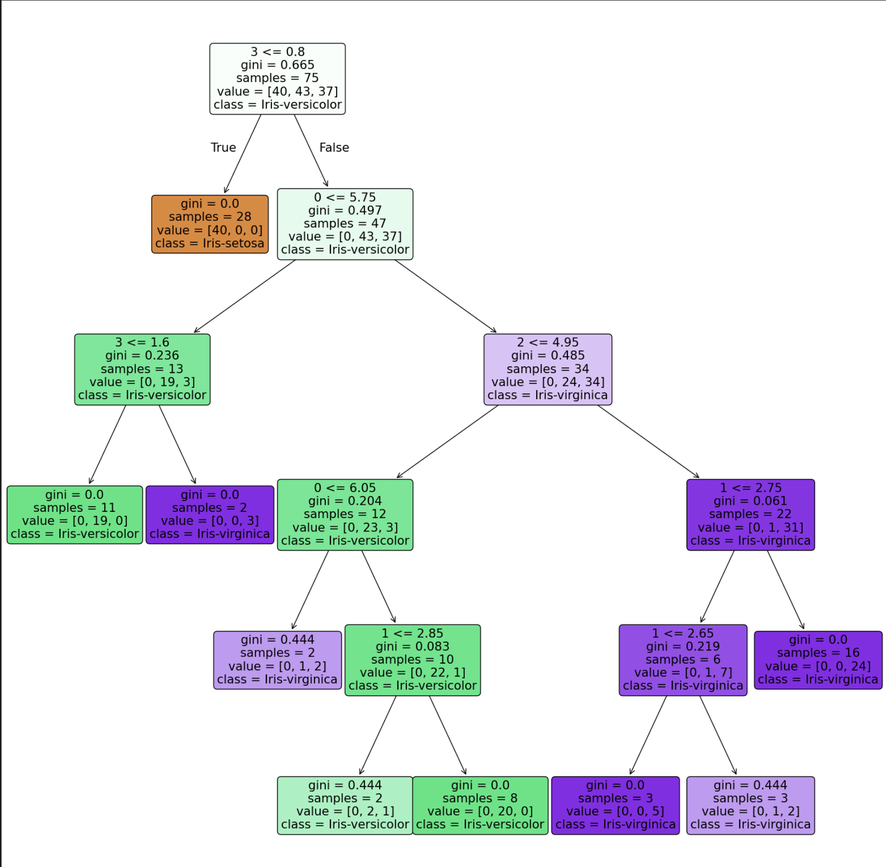
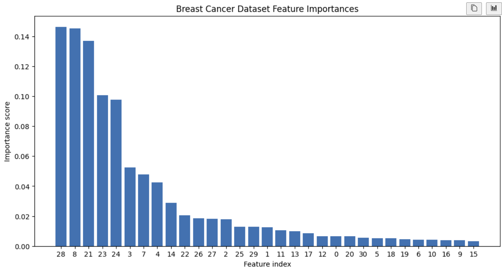
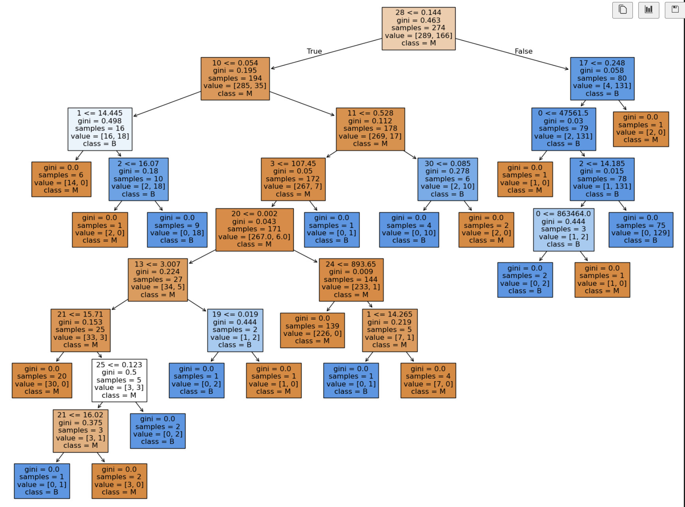

# Report for results
## 0. Introduction
Classification is one of the fundamental problems in data mining and machine learning. It addresses the task of assigning objects to predefined classes based on observed features. Formally, given a set of classes C := {C1, C2, ..., Ck}nd a set of labeled training objects O := {o1, o2, ..., on},where each object is associated with a class label through a mapping function M := O -> C, the goal of classification is to learn a model that captures this relationship. Once the model is constructed, it can be used to assign the most appropriate class label to previously unseen data points drawn from the same data domain. Classification techniques are widely used in practical applications such as pattern recognition, medical diagnosis, and decision support systems, making them a core topic in data mining research.
## 1. Experiment setup
In this task, our main goal was to use classification method on given datasets, and to implement custom K-Nearest-Neighbor (KNN) algorithm, and compare it with other available algorithms and implementations.
### 1.1. Datasets Description
In this experiment, two well-known benchmark datasets were selected to evaluate the performance of the classification methods.

### 1.1.1 Iris Dataset  
The **Iris dataset** is a classical multiclass classification dataset consisting of **150 samples** and **4 numerical features**. The objective is to classify each sample into one of the following three iris species:
- *Iris Setosa*
- *Iris Versicolour*
- *Iris Virginica*

The dataset includes the following features:
- Sepal length  
- Sepal width  
- Petal length  
- Petal width  

All features are measured in centimeters (cm). The dataset contains **no missing values**, which allows direct application of classification algorithms without additional preprocessing.

### 1.1.2. Breast Cancer Dataset  
The **Breast Cancer dataset** is a more complex **binary classification** dataset containing **569 samples** and **30 continuous features**, as summarized in Table 1. The goal is to predict whether a tumor is:
- **Benign (B = 0)**  
- **Malignant (M = 1)**  

This dataset consists of an identifier attribute, a diagnostic target variable, and multiple features describing tumor characteristics. All features are continuous and the dataset contains **no missing values**.

---

### Table 1: Breast Cancer Dataset Attributes

| Variable Name | Role | Type | Missing Values |
|--------------|------|------|----------------|
| ID | ID | Categorical | No |
| Diagnosis | Target | Categorical | No |
| radius1 | Feature | Continuous | No |
| texture1 | Feature | Continuous | No |
| perimeter1 | Feature | Continuous | No |
| area1 | Feature | Continuous | No |
| smoothness1 | Feature | Continuous | No |
| compactness1 | Feature | Continuous | No |
| concavity1 | Feature | Continuous | No |
| concave_points1 | Feature | Continuous | No |
| symmetry1 | Feature | Continuous | No |
| fractal_dimension1 | Feature | Continuous | No |
| radius2 | Feature | Continuous | No |
| texture2 | Feature | Continuous | No |
| perimeter2 | Feature | Continuous | No |
| area2 | Feature | Continuous | No |
| smoothness2 | Feature | Continuous | No |
| compactness2 | Feature | Continuous | No |
| concavity2 | Feature | Continuous | No |
| concave_points2 | Feature | Continuous | No |
| symmetry2 | Feature | Continuous | No |
| fractal_dimension2 | Feature | Continuous | No |
| radius3 | Feature | Continuous | No |
| texture3 | Feature | Continuous | No |
| perimeter3 | Feature | Continuous | No |
| area3 | Feature | Continuous | No |
| smoothness3 | Feature | Continuous | No |
| compactness3 | Feature | Continuous | No |
| concavity3 | Feature | Continuous | No |
| concave_points3 | Feature | Continuous | No |
| symmetry3 | Feature | Continuous | No |
| fractal_dimension3 | Feature | Continuous | No |

### 1.2. What classifiers

The main objective of this task was to implement a custom **k-Nearest Neighbors (K-NN)** classifier from scratch, providing a `.fit(X, y)` method for training and a `.predict(X)` method for inference. The performance of this custom implementation was then compared against the **KNeighborsClassifier** provided by the *scikit-learn* library to validate correctness and efficiency.

In addition, a third classifier was selected for comparison. In this work, a **Random Forest** classifier was chosen due to its strong empirical performance and robustness. Random Forest combines multiple decision trees through ensemble learning, which significantly reduces overfitting and improves generalization. Furthermore, it is resilient to noise, performs well on high-dimensional datasets, and typically requires minimal hyperparameter tuning compared to many other classification methods.

### 1.3. How training and test samples are selected
The experimental procedure started with a preprocessing step in which the feature matrix **X** was separated from the corresponding class labels **y**. The dataset was then divided into a training set comprising **80%** of the samples and a test set comprising the remaining **20%**, as specified in the task requirements.

In general, preprocessing also includes handling missing values; however, this step was not necessary in this case, as both datasets used in the experiments contained **no missing values**.

### 1.4. How were the parameters for the classification method optimized
Since the selected classifiers have a limited number of hyperparameters, **GridSearchCV** from the *scikit-learn* library was used to perform systematic hyperparameter optimization. This approach evaluates multiple combinations of model parameters using cross-validation and selects the configuration that achieves the best validation performance.

For the **k-Nearest Neighbors (KNN)** classifier, only a single hyperparameter needs to be optimized: the number of neighbors \( k \). A search range of \( k \in [2, 21] \) was defined, and the classifier was evaluated for each value of \( k \). The optimal value was selected as the one that minimized the validation loss.

For the **Random Forest** classifier, the same GridSearchCV-based approach was applied. In this case, multiple hyperparameters influence the model performance, and a small but representative search space was defined by selecting three values for each parameter:
- **n_estimators**: the number of decision trees in the ensemble, set to \([50, 100, 150]\)
- **max_depth**: the maximum depth of each decision tree, set to \([10, 20, 30]\)
- **min_samples_split**: the minimum number of samples required to split an internal node, set to \([2, 5, 10]\)

This strategy allows efficient exploration of the hyperparameter space while keeping the computational cost manageable.

## 2. Presentation results
- Here are the results of our experiment on the three classifiers
### 2.1. Accuracy scores
- 
- It was found from Fig 1 that:
  - On iris dataset all the models got accuracy 1.0 due to the simplicity of the dataset, and easy to separate. 
  - On breast cancer dataset random-forest clearly outperforms both KNN implementations, which the custom KNN and scikit-learn KNN acieve identical accuracy. 
### 2.2. Runtime for training and prediction for each classifier
1. Training runtime (Fig. 2):
   - 
2. Prediction runtime (Fig. 3) : 
   -   
Figure 2 presents the training runtime of the evaluated classifiers on both datasets.
Random Forest shows significantly higher training time due to the construction of multiple decision trees, with the effect being more pronounced on the Breast Cancer dataset.
Both KNN implementations exhibit substantially lower training times, as training mainly consists of storing the training samples rather than building an explicit model.
Notice that training also includes performing Gridsearch to find the best parameters.
Figure 3 illustrates the prediction runtime of the classifiers.
KNN-based methods require higher prediction time since each test sample must be compared against all training samples.
Random Forest achieves faster prediction by traversing a fixed number of pre-trained decision trees.

### 2.3. Visualization of the trained classification model. 
- Random forest (iris) (Fig. 4): 
  - 
  - Fig. 4 shows the feature importance scores for the Iris dataset as computed by a Random Forest classifier. The x-axis represents the feature indices, where index 3 corresponds to petal width, index 2 to petal length, index 0 to sepal length, and index 1 to sepal width. The plot clearly indicates that petal width and petal length are by far the most influential features in the classification decision, together accounting for the majority of the total importance score. In contrast, sepal length and especially sepal width contribute much less to the model’s predictions. This confirms a well-known characteristic of the Iris dataset: the separation between species is mainly driven by petal-related measurements, while sepal features play a secondary role.
- Random forest (iris) one decision tree (Fig. 5)
  - 
  - Fig. 5 shows a decision tree trained on the Iris dataset and visualizes how the model makes classification decisions based on feature thresholds. Each internal node represents a split rule of the form feature ≤ threshold (the number at the top is the feature index), where the left branch corresponds to the condition being true and the right branch to false. The gini value measures node impurity (0 means all samples belong to one class), samples indicates how many training instances reach that node, and value shows the class distribution [Setosa,Versicolour,Virginica] [Setosa,Versicolour,Virginica]. The class label is the predicted class at that node, determined by the majority of samples. Leaf nodes (no further splits) represent final decisions. Overall, the tree illustrates that the Iris species are mainly separated using petal-related features, with early splits already achieving pure nodes (gini = 0), which explains why very high accuracy is achievable on this dataset.
- Random forest (Breast Cancer) features importance (Fig. 6)
  - 
  - Fig. 6 presents the feature importance scores for the Breast Cancer dataset as computed by the Random Forest classifier. The x-axis shows the feature indices, sorted in descending order of importance, while the y-axis represents the relative contribution of each feature to the model’s decision-making process. The plot reveals that a small subset of features dominates the classification, contributing most strongly to the discrimination between benign and malignant tumors, whereas many features have only marginal influence. This behavior is typical for high-dimensional medical datasets, where only a limited number of attributes carry significant predictive information. The results highlight Random Forest’s ability to automatically identify and prioritize the most informative features, improving both model interpretability and classification performance.
- Random forest (Breast cancer) one decision tree (Fig. 7)
  - 
  - Fig. 7 visualizes a **decision tree trained on the Breast Cancer dataset**, illustrating how the model classifies tumors as **malignant (M)** or **benign (B)** through a sequence of feature-based threshold decisions. Each internal node represents a split on a specific feature (shown by its index) with a threshold value, while the **gini index** indicates how pure the node is (lower values mean better class separation). The **samples** field shows how many training instances reach that node, and **value** gives the class distribution ([M, B]). Leaf nodes correspond to final classification decisions, many of which achieve **gini = 0**, indicating perfect separation for those subsets. Overall, the depth and complexity of the tree reflect the higher dimensionality and difficulty of the Breast Cancer dataset compared to Iris, and also highlight why a single tree is mainly useful for interpretability rather than as a standalone high-performance model.

## 3. Conclusion
In this work, a custom implementation of the k-Nearest Neighbors classifier was developed and evaluated on two benchmark datasets, and its performance was compared with the scikit-learn KNN and a Random Forest classifier. The experimental results show that all classifiers achieved perfect accuracy on the Iris dataset, indicating that it is easily separable and well-suited for simple classification methods. On the more complex Breast Cancer dataset, Random Forest significantly outperformed both KNN implementations, demonstrating its strength in handling high-dimensional data and capturing complex decision boundaries. Runtime analysis revealed a clear trade-off between training and prediction efficiency: KNN classifiers require minimal training time but incur higher prediction costs, while Random Forest exhibits higher training time but faster prediction. Feature importance analysis further showed that only a subset of features contributes strongly to classification, especially in the Breast Cancer dataset. Overall, the results highlight the importance of selecting a classifier based on dataset complexity, dimensionality, and computational constraints, and confirm the correctness and limitations of the custom KNN implementation when compared to optimized library-based models.